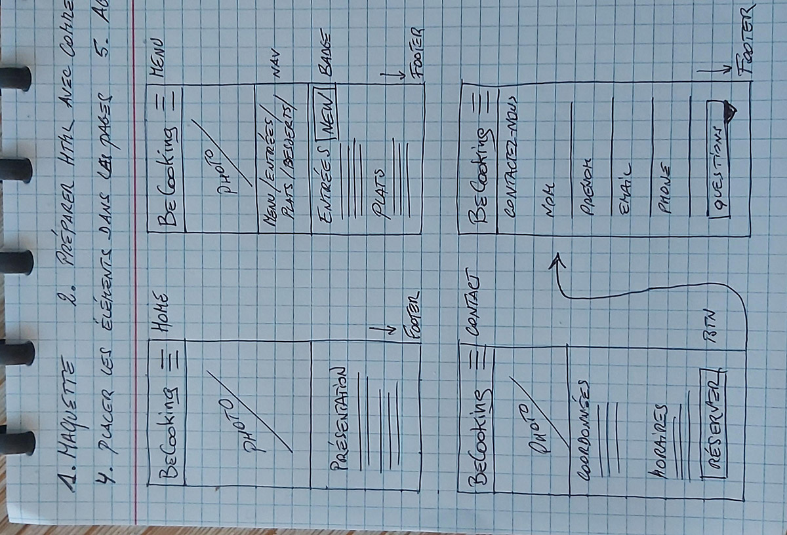
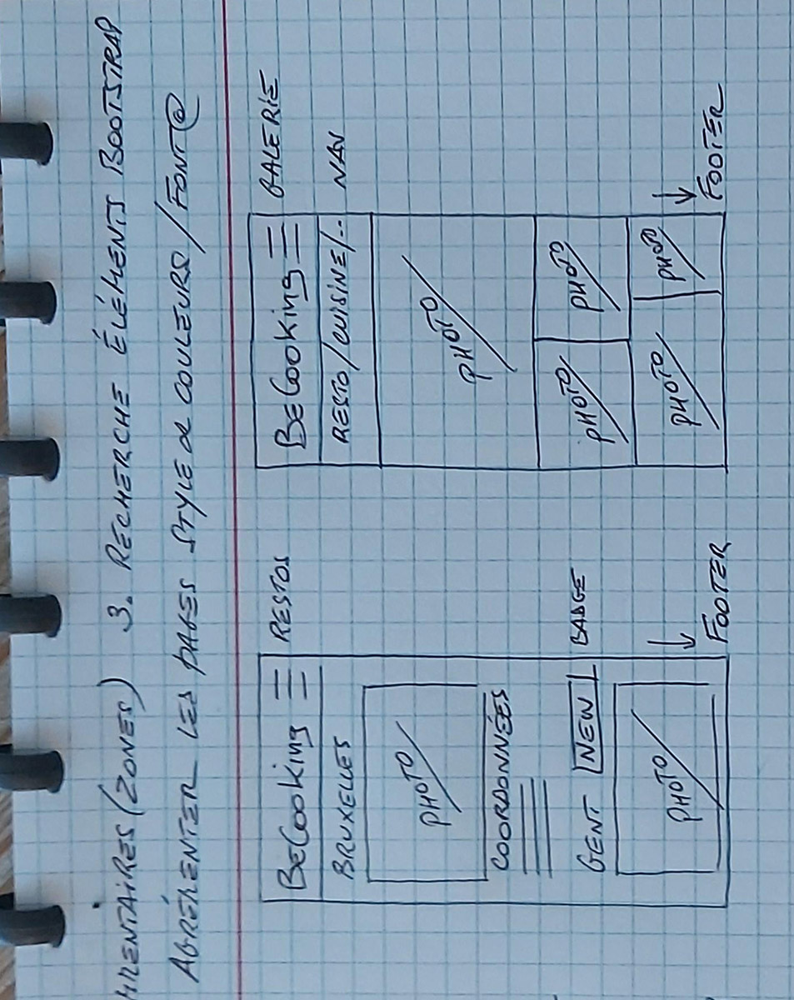
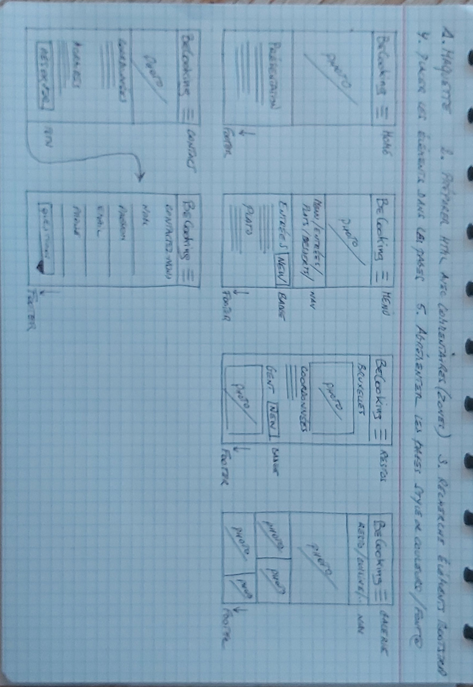

# restaurant-css-framework
Retrouvez ici toutes les informations concernant le site Restaurant BeCool Cooking...
C'est à dire toutes les techniques utilisées, les endroits d'où proviennent les photos présentent sur le site ainsi que le lien direct vers le site BeCool Cooking.

### Il est important de savoir que ce site, ainsi que toutes les données présentes sur ce dernier, ne transmet que des informations fictives et que toutes similitudes ou ressemblances avec des personnes ou des lieux connus seraient purement fortuits !

## Table des matières
1. [Nom et logo du projet-site internet](#Nom-et-logo-du-projet-site-internet)
2. [Voici le site réalisé](#Voici-le-site-réalise)
3. [Réalisation](#Realisation)
4. [Github](#Github)
5. [Code et langages utilisés](#Code-et-langages-utilises)
6. [Photos licences](#Photos-licences)
7. [Mock-up](#Mock-up)

***

## Nom et logo du projet-site internet

# BeCool Cooking - Restaurant

## Voici le site réalisé
[Je vous présente BeCool Cooking](https://christianjadot.github.io/restaurant-css-framework/)

## Réalisation
Ce site a été réalisé grâce à Boostrap v4.6 et construit dans Visual Studio Code.
Il a été optimisé pour une vision Smartphone avant tout qui s'étend ensuite vers la vision sur desktop.
Ce site comprend 5 pages : Home / Menu / Restaurants / Galeries / Contact
Je me suis chargé de l'entièreté de la réalisation, de la création du logo ainsi que de la recherche des photos.
Il aura fallu 4 journées de ± 8 heures pour la réalisation telle que vous la voyez.
Le site Bootstrap a été d'une bonne aide pour diverses éléments à placer.

## Github
L'ensemble des éléments "Pages et dossiers images" ont été placées sur Github
Voici le repo sur [Github](https://github.com/ChristianJadot/restaurant-css-framework)

## Code et langages utilisés
HTML5 / CSS3
Bootstrap 4.6

## Photos licences
Toutes les photos utilisées proviennent du site [Freepik](https://www.freepik.com/)

## Mock-up
Ci-dessous le mock-up (papier) du site version smartphone

